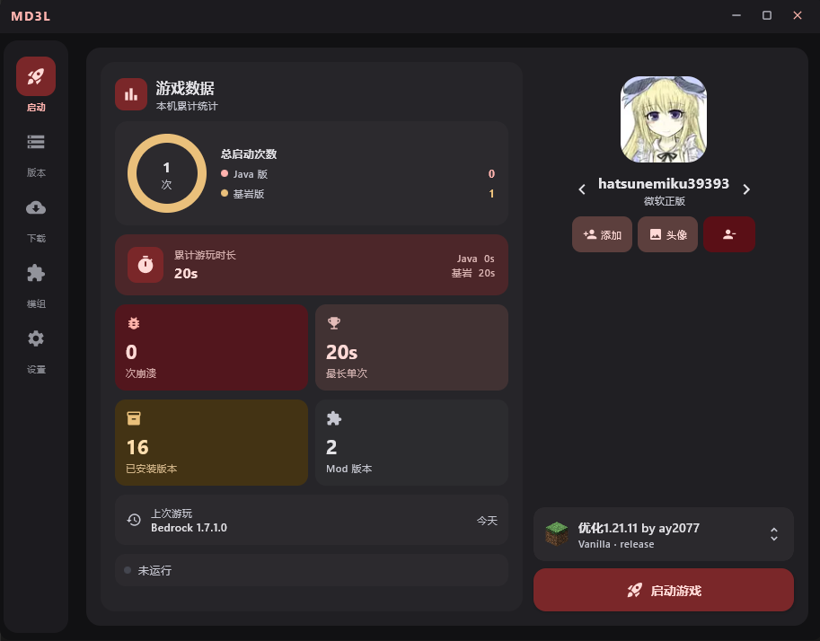
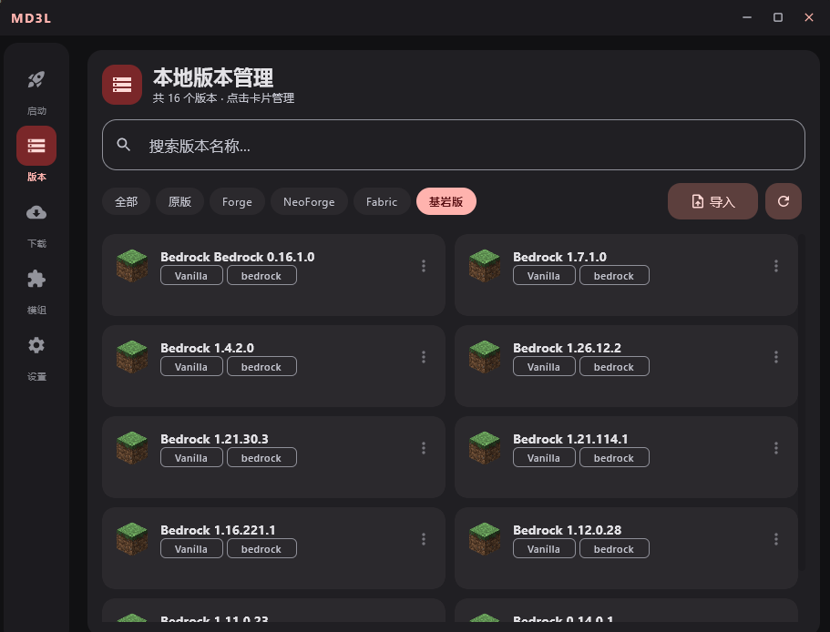
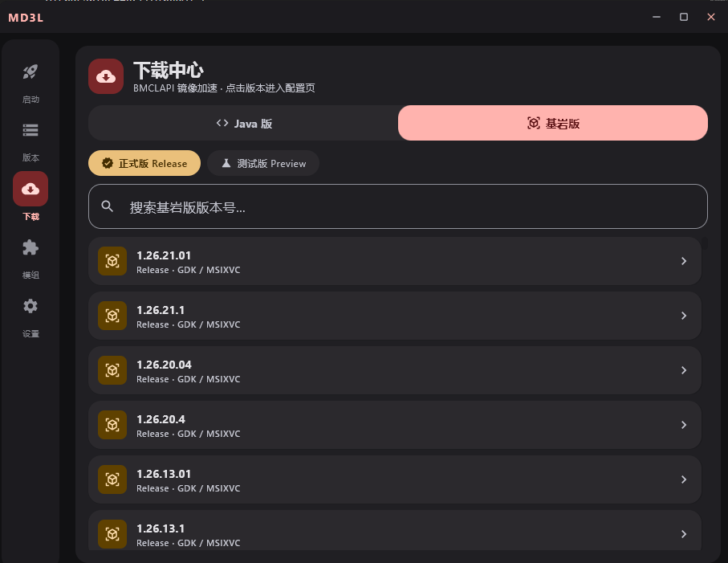
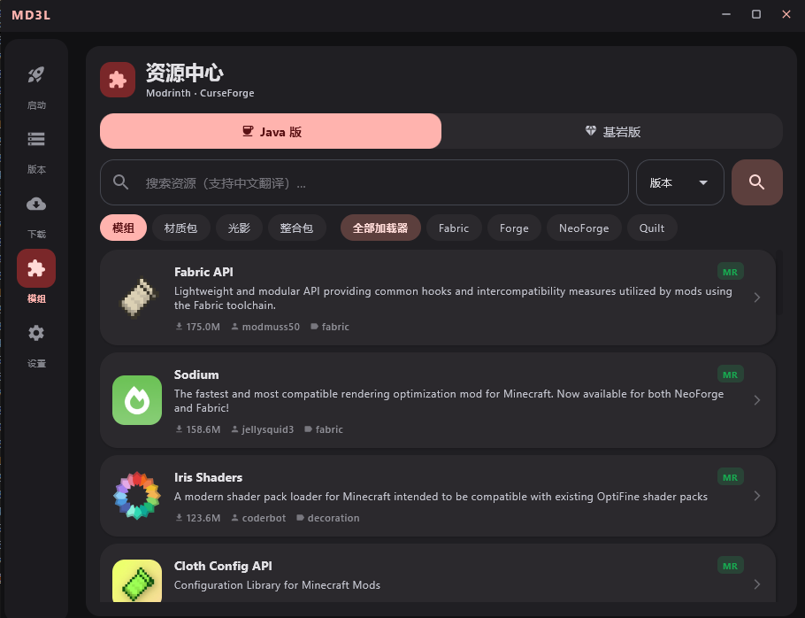
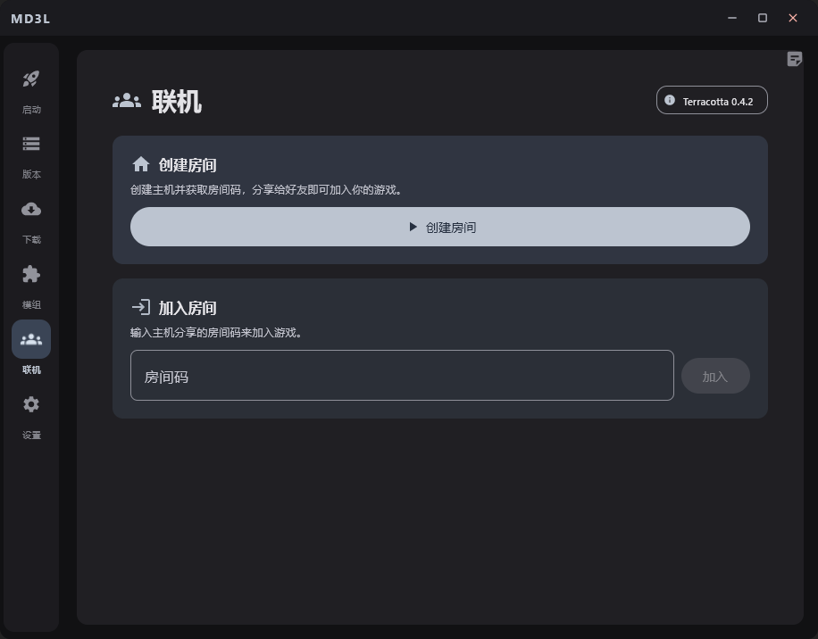
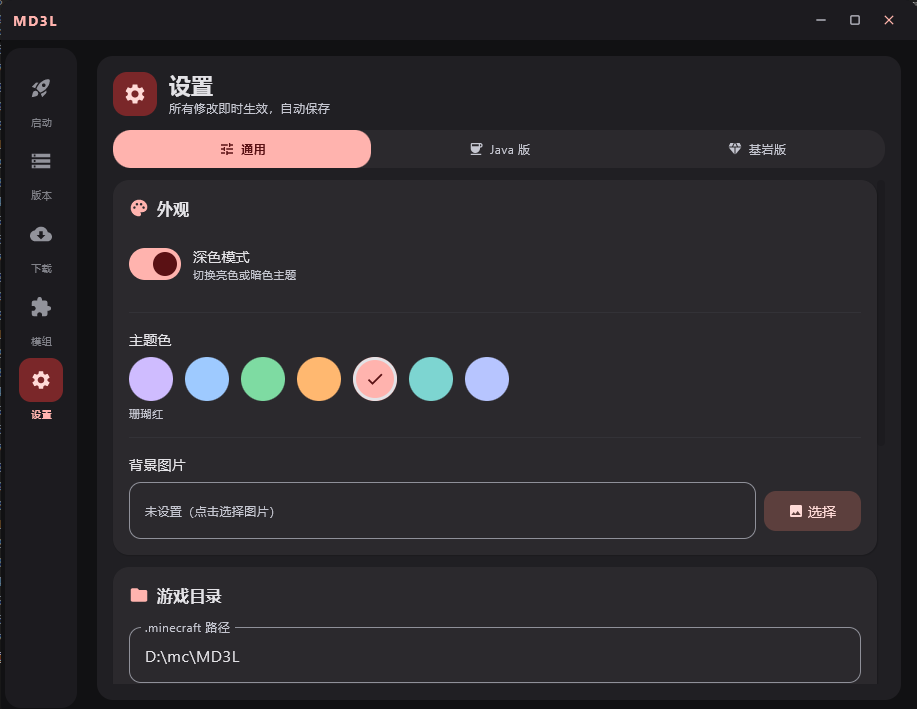

# MD3L

一个 Material Design 3 风格的 Minecraft 启动器，同时支持 Java 版和基岩版。用 Kotlin + Compose Desktop 写的。

## 为什么要写这个

市面上大多数启动器要么只做 Java 版，要么界面停留在 WinForm/WPF 时代。MD3L 想提供一个现代、好看、同时搞定两个版本的选择。

## 能干什么

- **Java 版** — 支持 Forge / NeoForge / Fabric / Quilt，.mrpack 整合包拖拽导入，OptiFine 静默安装
- **基岩版** — MSIX / GDK 直接装直接启动，正式版和预览版随便切，支持离线
- **远程联机** — 基于 Terracotta 中继网络，创房间、分享房间码就能和朋友联机，房主可以踢人
- **桌面贴纸** — 把 PNG / JPG / GIF 拖进启动器当贴纸玩，随便拖位置、调大小，GIF 还能调速
- **模组资源中心** — 内置 Modrinth 和 CurseForge 双源搜索，中文关键词自动翻译
- **多账号** — 微软正版、离线、Yggdrasil（LittleSkin / AuthMe）都行
- **游戏数据统计** — 启动次数、游玩时长、崩溃率，帮你搞清楚玩了多久
- **BMCLAPI 镜像加速** — 国内下载不用等
- **自动更新** — 检测到新版本一键升

## 截图

| 首页仪表盘 | 版本管理 | 下载中心 |
|---|---|---|
|  |  |  |

| 模组资源 | 远程联机 | 个性化设置 |
|---|---|---|
|  |  |  |

## 下载

去 [Release 页面](https://github.com/zhou1844/MD3L/releases) 下最新安装包。

或者直接走 OneDrive 直链（最新版）：  
👉 **[下载 MD3L Setup.exe](https://dlink.host/1drv/aHR0cHM6Ly8xZHJ2Lm1zL3UvYy80NmEyZjAxZDI1NjA4YjI5L0lRQXhjLWpkb2tnSVNJbjZ3UHpHQUptNUFhZEtnSW5iR2lLQjFFTDRsSlVJZXhRP2U9cjZ6M0Vi.exe)**

系统要求：Windows 10 / 11 64 位，不需要装 Java（内置了）。

也可以访问项目网站：[md3l.pages.dev](https://md3l.pages.dev)

## 构建

```bash
# 开发运行
gradlew run

# 打包 EXE
gradlew createReleaseDistributable

# 构建安装器（需要安装 Inno Setup 6）
build-installer.bat
```

技术栈：
- Kotlin 1.9.22 + JDK 17
- Compose Multiplatform Desktop (JetBrains)
- Ktor (HTTP / WebSocket)
- JNA (Windows COM 互操作，基岩版 UWP 激活)
- Material 3 (MaterialTheme)

## 项目结构

```
src/main/kotlin/launcher/
├── core/          # 核心逻辑：下载引擎、启动引擎、账号、联机、贴纸
├── ui/
│   ├── screens/   # 各页面：启动、版本、模组、联机、设置等
│   ├── components/# 可复用组件：贴纸板、版本图标、下载悬浮按钮
│   ├── layout/    # 主布局、导航栏
│   └── theme/     # MD3 主题、色彩方案
└── Main.kt        # 入口，窗口管理，拖拽导入
```

## 致谢

- [BMCLAPI](https://bmclapidoc.bangbang93.com/) — 国内下载镜像
- [Terracotta](https://github.com/Glavo/Terracotta) — 联机中继工具
- [HMCL](https://github.com/HMCL-dev/HMCL) — 很多实现思路的参考
- Minecraft 当然是 Mojang 的

## License

MIT — 随便用，随便改。玩得开心。
