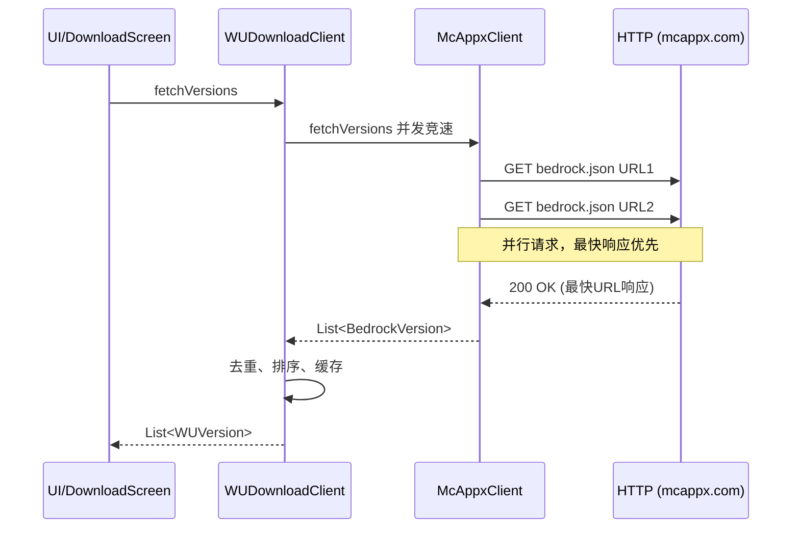
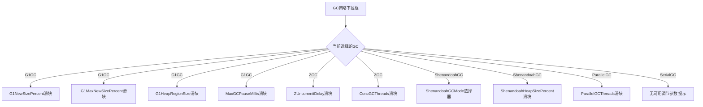

# MD3L 架构重构规划方案

> 分析基于以下文件：
> - [`McAppxClient.kt`](MD3L1/src/main/kotlin/launcher/core/McAppxClient.kt)
> - [`WUDownloadClient.kt`](MD3L1/src/main/kotlin/launcher/core/WUDownloadClient.kt)
> - [`BedrockDownloadManager.kt`](MD3L1/src/main/kotlin/launcher/core/BedrockDownloadManager.kt)
> - [`AppSettings.kt`](MD3L1/src/main/kotlin/launcher/core/AppSettings.kt)
> - [`SettingsScreen.kt`](MD3L1/src/main/kotlin/launcher/ui/screens/SettingsScreen.kt)
> - [`JavaLaunchEngine.kt`](MD3L1/src/main/kotlin/launcher/core/JavaLaunchEngine.kt)
> - [`DownloadScreen.kt`](MD3L1/src/main/kotlin/launcher/ui/screens/DownloadScreen.kt)
> - [`VersionDetailScreen.kt`](MD3L1/src/main/kotlin/launcher/ui/screens/VersionDetailScreen.kt)
> - [`ModDetailScreen.kt`](MD3L1/src/main/kotlin/launcher/ui/screens/ModDetailScreen.kt)
> - [`CfBedrockDetailScreen.kt`](MD3L1/src/main/kotlin/launcher/ui/screens/CfBedrockDetailScreen.kt)
> - [`Theme.kt`](MD3L1/src/main/kotlin/launcher/ui/theme/Theme.kt)

---

## 目录

1. [问题一：Bedrock 版本列表获取速度优化与数据源清理](#问题一bedrock-版本列表获取速度优化与数据源清理)
2. [问题二：GC 选择与自定义 JVM 参数双向联动](#问题二gc-选择与自定义-jvm-参数双向联动)
3. [问题三：下载详情页 UI 重构 -- 统一 MD3 组件化](#问题三下载详情页-ui-重构----统一-md3-组件化)
4. [综合修改文件清单](#综合修改文件清单)

---

## 问题一：Bedrock 版本列表获取速度优化与数据源清理

### 现状分析

[`McAppxClient`](MD3L1/src/main/kotlin/launcher/core/McAppxClient.kt:11) 的 `V2_SOURCES` 包含 4 个 URL，[`fetchVersions()`](MD3L1/src/main/kotlin/launcher/core/McAppxClient.kt:34) 使用**顺序循环**依次尝试每个 URL，每次失败需要等待 `CONNECT_TIMEOUT` (12s) + `READ_TIMEOUT` (20s) = **32 秒超时**。若前 3 个 URL 均不可用，需等待 **96 秒** 才能降级到第 4 个；即使首个 URL 可用也必须串行等待。

[`WUDownloadClient.refreshFromNetwork()`](MD3L1/src/main/kotlin/launcher/core/WUDownloadClient.kt:160) 在加载 `McAppxClient.fetchVersions()` 后，还额外补充了 3 个数据源：
1. **LeviLauncher DB** (LiteLDev GDK 版本数据库，2 个 URL)
2. **GdkLinks** (MinecraftBedrockArchiver，3 个 URL)
3. **MCMrARM UWP DB** (旧版 UWP 版本数据库，3 个 URL)

这些补充源当前主要用于获取 GDK 类型版本（≥1.21.120.21），但从架构上看，`McAppxClient` 返回的版本列表已足够覆盖全部版本需求（包含 UWP 和 GDK），且补充网络的额外 HTTP 请求进一步拖慢了整体刷新速度。

### 修改方案

#### 1.1 McAppxClient 改造

| 修改项 | 当前行为 | 目标行为 |
|--------|---------|---------|
| `V2_SOURCES` | 4 个 URL 顺序尝试 | 缩减为 1 个首选 URL + 1 个备用 URL |
| 超时策略 | 12s connect + 20s read = 32s/URL | 8s connect + 10s read，**并发竞速** |
| 并发机制 | 无，纯顺序 | 使用 `coroutineScope` + `async` 并行发起所有请求，取最先成功结果 |

**并发竞速伪代码**：

```kotlin
suspend fun fetchVersions(): List<BedrockVersion> = withContext(Dispatchers.IO) {
    coroutineScope {
        val deferreds = V2_SOURCES.map { url ->
            async {
                runCatching {
                    parseV2Json(httpGet(url, connectTimeout = 8000, readTimeout = 10000))
                }.getOrNull()
            }
        }
        // 取第一个非空结果，`select` 风格：等待所有 async 完成
        deferreds.firstNotNullOfOrNull { it.await() } ?: emptyList()
    }
}
```

**注意**：在竞速模式下，所有请求并行发出，最快响应的 URL 会被优先采纳。为避免冗余网络流量，可将 URL 数量缩减至 2 个（主 + 备用）。

#### 1.2 WUDownloadClient 数据源清理

移除 `refreshFromNetwork()` 中除 `McAppxClient` 外的所有补充数据源：

| 待移除代码块 | 位置 | 说明 |
|-------------|------|------|
| `LEVI_GDK_URLS` 常量定义 | [`WUDownloadClient.kt:62-65`](MD3L1/src/main/kotlin/launcher/core/WUDownloadClient.kt:62) | 整个移除 |
| `GDK_VERSION_URLS` 常量定义 | [`WUDownloadClient.kt:67-71`](MD3L1/src/main/kotlin/launcher/core/WUDownloadClient.kt:67) | 整个移除 |
| `UWP_VERSION_URLS` 常量定义 | [`WUDownloadClient.kt:56-60`](MD3L1/src/main/kotlin/launcher/core/WUDownloadClient.kt:56) | 整个移除 |
| `refreshFromNetwork()` 中补充 Levi 逻辑 | [`WUDownloadClient.kt:182-189`](MD3L1/src/main/kotlin/launcher/core/WUDownloadClient.kt:182) | 整个移除 |
| `refreshFromNetwork()` 中补充 GdkLinks 逻辑 | [`WUDownloadClient.kt:191-198`](MD3L1/src/main/kotlin/launcher/core/WUDownloadClient.kt:191) | 整个移除 |
| `refreshFromNetwork()` 中补充 UWP DB 逻辑 | [`WUDownloadClient.kt:201-208`](MD3L1/src/main/kotlin/launcher/core/WUDownloadClient.kt:201) | 整个移除 |
| `loadLocal()` 中 Levi/GDK/UWP 缓存读取 | [`WUDownloadClient.kt:119-157`](MD3L1/src/main/kotlin/launcher/core/WUDownloadClient.kt:119) | 简化，仅保留 McAppx 缓存 |
| `parseLeviVersions()` | [`WUDownloadClient.kt:250-278`](MD3L1/src/main/kotlin/launcher/core/WUDownloadClient.kt:250) | 整个移除 |
| `parseGdkVersions()` | [`WUDownloadClient.kt:280-314`](MD3L1/src/main/kotlin/launcher/core/WUDownloadClient.kt:280) | 整个移除 |
| `parseUwpVersions()` | [`WUDownloadClient.kt:236-243`](MD3L1/src/main/kotlin/launcher/core/WUDownloadClient.kt:236) | 整个移除 |

**保留**：
- `WUDownloadClient` 核心功能：`resolveDownloadUrl()`、`downloadFile()`、chunked download 引擎
- `deduplicateGdkUwp()` 可简化或移除

#### 1.3 BedrockDownloadManager 联动调整

[`BedrockDownloadManager`](MD3L1/src/main/kotlin/launcher/core/BedrockDownloadManager.kt) 中与 `WUDownloadClient.WUVersion` 相关的下载流程不受影响，但需注意：

- `WUDownloadSource` 枚举 (`Auto`, `WuOfficial`, `McAppxMirror`, `Xbox*`) 保持不变
- `availableSources()` 中的 GDK/UWP 区分逻辑保持不变（基于 `ver.isGdk`）
- 下载和安装流程无需调整

#### 1.4 时序图：改造后的版本刷新流程



---

## 问题二：GC 选择与自定义 JVM 参数双向联动

### 现状分析

[`SettingsScreen.kt`](MD3L1/src/main/kotlin/launcher/ui/screens/SettingsScreen.kt) 中存在两个完全独立的 UI 元素：

1. **GC 策略下拉框** (`settings.gcPolicy`) -- 第 577-598 行，选择 `G1GC`/`ZGC`/`ShenandoahGC`/`ParallelGC`/`SerialGC`
2. **自定义 JVM 参数文本框** (`settings.customJvmArgs`) -- 第 683-691 行，用户手动输入 `-XX:+UseG1GC ...` 等

**两者之间没有任何同步逻辑**。用户修改 GC 下拉框不会更新 `customJvmArgs`，反之亦然。

在 [`JavaLaunchEngine.buildJvmArguments()`](MD3L1/src/main/kotlin/launcher/core/JavaLaunchEngine.kt:706-756) 中：
- 第 707 行：检测 `hasCustomGc = userArgs.any { it.startsWith("-XX:+Use") && it.contains("GC") }`
- 若用户已在 `customJvmArgs` 中写了 GC 标志，则跳过自动 GC 策略注入
- 若没有，则根据 `gcPolicy` 自动注入对应的 GC 参数和 G1 调优参数

此外，**精细调节仅对 G1GC 有效**（ZGC、ShenandoahGC、ParallelGC、SerialGC 无对应 UI 调节项）。

### 修改方案

#### 2.1 AppSettings 数据模型扩展

在 [`AppSettings`](MD3L1/src/main/kotlin/launcher/core/AppSettings.kt:11) 中新增字段：

```kotlin
// 新增 GC 精细调节字段
val jvmZUncommitDelay: Int = 60,           // ZGC: ZUncommitDelay (秒)
val jvmShenandoahMode: String = "iu",       // ShenandoahGC: 模式 iu/passive/satb
val jvmShenandoahHeapSizePercent: Int = 10, // ShenandoahGC: -XX:ShenandoahHeapSizePercent
val jvmParallelGCThreads: Int = 0,          // ParallelGC: -XX:ParallelGCThreads, 0=auto
val jvmConcGCThreads: Int = 0,              // ZGC/Shenandoah: -XX:ConcGCThreads, 0=auto
```

#### 2.2 双向同步机制

**方案：GC策略 -> CustomJvmArgs 单向同步（推荐）**

在 GC 下拉框的 `onClick` 回调中添加同步逻辑：

```kotlin
onClick = {
    val newGcFlag = when (gc) {
        "G1GC" -> "-XX:+UseG1GC -XX:+UnlockExperimentalVMOptions"
        "ZGC" -> "-XX:+UseZGC -XX:+UnlockExperimentalVMOptions"
        "ShenandoahGC" -> "-XX:+UseShenandoahGC -XX:+UnlockExperimentalVMOptions"
        "ParallelGC" -> "-XX:+UseParallelGC"
        "SerialGC" -> "-XX:+UseSerialGC"
        else -> ""
    }
    // 从现有 customJvmArgs 中移除旧的 GC 标志
    val oldArgs = settings.customJvmArgs.split("\\s+".toRegex())
        .filter { it.isNotBlank() && !it.startsWith("-XX:+Use") || !it.contains("GC") }
    val newArgs = (oldArgs + newGcFlag.split(" ")).joinToString(" ")
    autoSave(settings.copy(gcPolicy = gc, customJvmArgs = newArgs.trim()))
    gcExpanded = false
}
```

**反向同步：CustomJvmArgs -> GC策略（有限支持）**

当用户在 `customJvmArgs` 文本框中输入/修改时，自动解析并更新 `gcPolicy`：

```kotlin
val detectedGc = parseGcFromArgs(newValue)
autoSave(settings.copy(customJvmArgs = newValue, gcPolicy = detectedGc ?: settings.gcPolicy))
```

辅助函数：

```kotlin
private fun parseGcFromArgs(args: String): String? {
    val gcFlags = mapOf(
        "UseG1GC" to "G1GC",
        "UseZGC" to "ZGC",
        "UseShenandoahGC" to "ShenandoahGC",
        "UseParallelGC" to "ParallelGC",
        "UseSerialGC" to "SerialGC",
    )
    val tokens = args.split("\\s+".toRegex())
    for (token in tokens) {
        gcFlags.forEach { (flag, name) ->
            if (token.contains(flag)) return name
        }
    }
    return null
}
```

**注意**：使用 `Debounce` 机制（300ms），避免每次按键都触发重解析。

#### 2.3 按 GC 类型显示精细调节面板

将当前固定的 "G1GC 精细调节" 部分改为**动态面板**，根据所选 `gcPolicy` 显示不同的调节选项：



**UI 结构建议**：

```kotlin
@Composable
fun GcFineTuningSection(gcPolicy: String, settings: AppSettings, autoSave: (AppSettings) -> Unit) {
    SettingsSection("${gcPolicy} 精细调节", Icons.Filled.Tune) {
        when (gcPolicy) {
            "G1GC" -> G1GcFineTuning(settings, autoSave)
            "ZGC" -> ZGcFineTuning(settings, autoSave)
            "ShenandoahGC" -> ShenandoahGcFineTuning(settings, autoSave)
            "ParallelGC" -> ParallelGcFineTuning(settings, autoSave)
            "SerialGC" -> {
                Text("SerialGC 为单线程 GC，无可用调节参数",
                     style = MaterialTheme.typography.labelSmall,
                     color = MaterialTheme.colorScheme.onSurfaceVariant)
            }
        }
    }
}
```

#### 2.4 JavaLaunchEngine 联动修改

当前 [`JavaLaunchEngine.buildJvmArguments()`](MD3L1/src/main/kotlin/launcher/core/JavaLaunchEngine.kt:706-756) 中：

- ZGC 分支（第 735-741 行）：硬编码 `-XX:ZUncommitDelay=60`，应改为读取 `jvmZUncommitDelay`
- ShenandoahGC 分支（第 742-748 行）：硬编码 `-XX:ShenandoahGCMode=iu`，应改为读取 `jvmShenandoahMode`

**但注意**：若用户通过 UI 双向同步机制设置了 `customJvmArgs` 中的 GC 标志，则 `hasCustomGc` 为 true，整个自动注入会被跳过。这意味着：
- 如果用户手动输入了 `-XX:+UseZGC` 到 customJvmArgs，精细调节参数来自 `customJvmArgs` 中的手动输入，而非 `jvmG1*` 字段
- 这实际上是期望的行为：用户手动模式更高优先级

需要新增一个**辅助函数**来从 `AppSettings` 字段构建精细调节参数串，供 UI 预览或同步到 `customJvmArgs`：

```kotlin
fun buildGcFineTuningArgs(gcPolicy: String, settings: AppSettings): String {
    return when (gcPolicy) {
        "G1GC" -> "-XX:G1NewSizePercent=${settings.jvmG1NewSizePercent} -XX:G1MaxNewSizePercent=${settings.jvmG1MaxNewSizePercent} -XX:G1HeapRegionSize=${settings.jvmG1HeapRegionSize}m -XX:MaxGCPauseMillis=${settings.jvmG1GCPauseTarget}"
        "ZGC" -> "-XX:ZUncommitDelay=${settings.jvmZUncommitDelay}"
        "ShenandoahGC" -> "-XX:ShenandoahGCMode=${settings.jvmShenandoahMode}"
        "ParallelGC" -> if (settings.jvmParallelGCThreads > 0) "-XX:ParallelGCThreads=${settings.jvmParallelGCThreads}" else ""
        else -> ""
    }
}
```

---

## 问题三：下载详情页 UI 重构 -- 统一 MD3 组件化

### 现状分析

共 4 个下载详情页，分布在 4 个文件中：

| 页面 | 文件 | 行数 | 用途 |
|------|------|------|------|
| **Java 版本安装配置** | [`VersionDetailScreen.kt`](MD3L1/src/main/kotlin/launcher/ui/screens/VersionDetailScreen.kt:47) | 818 | Java 版本下载安装配置 + 加载器/OptiFine |
| **基岩版本安装配置** | [`BedrockVersionDetailScreen`](MD3L1/src/main/kotlin/launcher/ui/screens/DownloadScreen.kt:44) | 270 | 基岩版本下载安装 + 下载源选择 |
| **Java 模组/资源包** | [`ModDetailScreen.kt`](MD3L1/src/main/kotlin/launcher/ui/screens/ModDetailScreen.kt:37) | 605 | Modrinth/CurseForge 模组下载，版本筛选，前置依赖 |
| **基岩 Addon/资源包** | [`CfBedrockDetailScreen.kt`](MD3L1/src/main/kotlin/launcher/ui/screens/CfBedrockDetailScreen.kt:35) | 485 | CurseForge 基岩内容下载，RP/BP 配对 |

各页面 UI 模式对比：

| 特性 | BedrockVersionDetailScreen | VersionDetailScreen | ModDetailScreen | CfBedrockDetailScreen |
|------|------|------|------|------|
| **布局** | Column + weight推底 | verticalScroll + Scrollbar | LazyColumn + Scrollbar | LazyColumn + Scrollbar |
| **返回按钮** | FilledTonalIconButton | 同左 | 同左 | 同左 + OpenInBrowser |
| **版本信息卡** | ElevatedCard(20dp) + 图标+文字+标签 | ElevatedCard(20dp) + VersionIcon+文字 | ElevatedCard(24dp) + KamelImage+文字 | ElevatedCard(20dp) + ModIcon+文字 |
| **卡片圆角** | 20dp主卡, 18dp进度, 14dp输入框 | 20dp主卡, 18dp进度, 14dp输入框 | 24dp横幅, 18dp卡片, 14dp输入框 | 20dp主卡, 18dp卡片, 12dp输入框 |
| **目标版本选择** | ExposedDropdownMenuBox(下载源) | 无 | ExposedDropdownMenuBox(本地版本) | ExposedDropdownMenuBox(本地版本) |
| **筛选器** | 无 | Loader FilterChips + ExposedDropdown | MC版本 + Loader筛选 | 无 |
| **进度面板** | LinearProgressIndicator | LinearProgressIndicator + 文件数 | CircularProgressIndicator(条目级) | CircularProgressIndicator(条目级) |
| **安装按钮** | 底部全宽 Button(16dp, 54dp) | 底部全宽 Button(16dp, 54dp) | 条目级 FilledIconButton(12dp) | 条目级 FilledIconButton(14dp) |
| **滚动** | 无 `ScrollState`，`Column` + `Modifier.weight(1f)` 推底按钮 | `verticalScroll(scrollState)` + `VerticalScrollbar` |
| **返回按钮** | `FilledTonalIconButton` + 图标 | 同左 |
| **版本图标** | `Image(painterResource("icons/command_block.png"))` | `VersionIcon(loaderType, versionType, size)` |
| **版本信息卡** | `ElevatedCard(shape=20dp)` + Row(图标+文字+标签) | `ElevatedCard(shape=20dp)` + Row(图标+文字+标签) |
| **卡片圆角** | 20dp 版本信息卡，18dp 进度卡，14dp 输入框 | 20dp 所有主卡，18dp 进度卡，14dp 输入框 |
| **选择器** | `ExposedDropdownMenuBox` 下载源选择 | `FilterChip` 加载器选择 + `ExposedDropdownMenuBox` 版本选择 |
| **切换控件** | 无 | `Switch` 控制 OptiFine 开关 |
| **进度面板** | `LinearProgressIndicator` + 文本 | `LinearProgressIndicator` + 文件计数 + 速度 |
| **底部按钮** | `Button(shape=16dp, height=54dp)` | `Button(shape=16dp, height=54dp)` |
| **主题适配** | 使用 `MaterialTheme.colorScheme.*` 但无显式 dark/light 逻辑 | 同左 |

### 重构方案

#### 3.1 新建共享组件文件

创建 [`MD3L1/src/main/kotlin/launcher/ui/components/DetailScreenComponents.kt`](MD3L1/src/main/kotlin/launcher/ui/components/DetailScreenComponents.kt) 包含以下可复用组件：

```mermaid
flowchart TD
    subgraph "DetailScreenComponents.kt"
        A[DetailScreenHeader] -- 返回按钮 + 图标 + 标题 + 副标题
        B[VersionInfoCard] -- 版本信息展示卡 图标/类型标签/版本号
        C[ConfigSectionCard] -- 带标题+图标的可折叠卡片容器
        D[ProgressCard] -- 进度条卡片 下载/安装状态
        E[InstallButton] -- 底部全宽安装按钮
        F[StatusBanner] -- 消息提示横幅 成功/错误/警告
    end
```

**组件详细设计**：

##### DetailScreenHeader

```kotlin
@Composable
fun DetailScreenHeader(
    title: String,
    subtitle: String,
    icon: Painter,
    iconTint: Color? = null,
    iconBackground: Color? = null,
)
```

- 左侧 `FilledTonalIconButton(shape=14dp, size=42dp)` 返回按钮
- 中间图标区（42dp 方形，14dp 圆角）
- 右侧标题列

##### VersionInfoCard

```kotlin
@Composable
fun VersionInfoCard(
    icon: @Composable () -> Unit,
    title: String,
    tags: @Composable RowScope.() -> Unit,
    containerColor: Color = MaterialTheme.colorScheme.primaryContainer.copy(alpha = 0.35f),
    shape: Shape = RoundedCornerShape(20.dp),
)
```

- `ElevatedCard(shape=20dp, elevation=2dp)`
- 内部 Row：自定义图标 composable + 标题 + 标签 Row

##### ConfigSectionCard

```kotlin
@Composable
fun ConfigSectionCard(
    title: String,
    icon: ImageVector,
    containerColor: Color = MaterialTheme.colorScheme.surfaceContainerHigh,
    shape: Shape = RoundedCornerShape(20.dp),
    content: @Composable ColumnScope.() -> Unit,
)
```

- `ElevatedCard(shape=20dp, elevation=1dp)`
- 统一的 padding=18dp
- 标题行：Icon(18dp, primary) + Spacer(8dp) + Text(titleSmall, SemiBold)
- `HorizontalDivider` 分隔线（可选）
- 内容区域通过 slot 注入

##### ProgressCard

```kotlin
@Composable
fun ProgressCard(
    isRunning: Boolean,
    isDone: Boolean,
    error: String,
    message: String,
    fraction: Float,
    accentColor: Color = MaterialTheme.colorScheme.primary,
    shape: Shape = RoundedCornerShape(18.dp),
)
```

- 根据状态自动选择容器颜色（error/primary/tertiary）
- 左侧状态图标（CircularProgressIndicator / CheckCircle / Error）
- 消息文本
- 运行时显示 LinearProgressIndicator

##### InstallButton

```kotlin
@Composable
fun InstallButton(
    isInstalling: Boolean,
    enabled: Boolean,
    onClick: () -> Unit,
    loadingText: String = "安装中…",
    normalText: String = "确认下载并安装",
    containerColor: Color = MaterialTheme.colorScheme.primary,
    shape: Shape = RoundedCornerShape(16.dp),
)
```

- `Button(fillMaxWidth, height=54dp, elevation=4dp)`
- 安装中显示 `CircularProgressIndicator` + 文本
- 可用时显示 `RocketLaunch` 图标 + 文本

##### StatusBanner

```kotlin
@Composable
fun StatusBanner(
    message: String,
    isError: Boolean = false,
    shape: Shape = RoundedCornerShape(14.dp),
)
```

- 错误时 `errorContainer` 背景，成功时 `primaryContainer` 背景
- 左侧对应图标 + 消息文本

#### 3.2 BedrockVersionDetailScreen 重构

使用新组件替换手写 UI：

```kotlin
@Composable
fun BedrockVersionDetailScreen(version: WUDownloadClient.WUVersion) {
    // ... state 保持不变 ...
    
    Column(
        modifier = Modifier.fillMaxSize(),
        verticalArrangement = Arrangement.spacedBy(12.dp),
    ) {
        DetailScreenHeader(
            title = "基岩版安装配置",
            subtitle = "选择下载源后开始安装",
            icon = painterResource("icons/command_block.png"),
        )
        
        VersionInfoCard(
            icon = { VersionInfoIcon(...) },
            title = version.name,
            tags = { TypeBadge(...) },
        )
        
        // 数据来源标注（特殊组件，不通用）
        DataSourceAttribution("mcappx.com")
        
        // 下载源选择
        ConfigSectionCard(title = "下载源", icon = Icons.Filled.CloudDownload) {
            SourceDropdown(...)
        }
        
        // 进度
        ProgressCard(
            isRunning = isDownloading && installProgress.phase == "downloading",
            isDone = installProgress.phase == "done",
            error = if (installProgress.phase == "error") installProgress.message else "",
            message = installProgress.message,
            fraction = installProgress.fraction,
        )
        
        // 结果
        result?.let { StatusBanner(message = it, isError = "失败" in it || "错误" in it) }
        localError.takeIf { it.isNotBlank() }?.let { StatusBanner(message = it, isError = true) }
        
        Spacer(Modifier.weight(1f))
        
        InstallButton(
            isInstalling = isDownloading,
            enabled = !isDownloading,
            onClick = { /* launch download */ },
            normalText = "开始下载并安装",
        )
    }
}
```

#### 3.3 VersionDetailScreen 重构

使用新组件替换：

```kotlin
@Composable
fun VersionDetailScreen(version: RemoteVersion) {
    // ... state 保持不变, 注意需要 verticalScroll ...
    
    Box(modifier = Modifier.fillMaxSize()) {
        Column(
            modifier = Modifier.fillMaxSize().verticalScroll(scrollState),
            verticalArrangement = Arrangement.spacedBy(12.dp),
        ) {
            DetailScreenHeader(
                title = "版本安装配置",
                subtitle = "选择加载器和 OptiFine 后点击安装",
                icon = ...,
                iconBackground = MaterialTheme.colorScheme.primaryContainer,
            )
            
            VersionInfoCard(
                icon = { VersionIcon(loaderType = ..., versionType = ..., size = 48) },
                title = version.id,
                tags = { /* VdChips */ },
            )
            
            ConfigSectionCard(title = "自定义版本名称", icon = Icons.Filled.DriveFileRenameOutline) {
                CustomNameField(...)
            }
            
            ConfigSectionCard(title = "模组加载器", icon = Icons.Filled.Build) {
                LoaderSelector(...)
            }
            
            ConfigSectionCard(title = "OptiFine 光影优化", icon = Icons.Filled.Tune) {
                OptiFineToggle(...)
            }
            
            // 安装总览摘要
            InstallSummary(...)
            
            // 进度
            ProgressCard(loaderProgress...)
            ProgressCard(downloadProgress...)
            
            // 消息
            installMessage.takeIf { it.isNotBlank() }?.let { StatusBanner(...) }
            
            InstallButton(...)
        }
        VerticalScrollbar(...)
    }
}
```

#### 3.4 MD3 规范统一

基于 [`Theme.kt`](MD3L1/src/main/kotlin/launcher/ui/theme/Theme.kt) 中已定义的 MD3 形状：

| 形状变量 | 当前值 | 使用场景 |
|---------|-------|---------|
| `extraSmall` | 8dp | TypeBadge 背景 |
| `small` | 12dp | FilterChip、状态横幅、输入框 |
| `medium` | 16dp | 安装按钮、加载器版本选择框 |
| `large` | 20dp | 主卡片（版本信息卡、配置段卡片） |
| `extraLarge` | 28dp | 暂未使用 |

**改进点**：
- 使用 `MaterialTheme.shapes.*` 替代硬编码 `RoundedCornerShape(xx.dp)`，或至少保证硬编码值对齐 Theme 定义
- 进度条 `LinearProgressIndicator` 的轨道圆角统一为 `4dp`
- 按钮高度统一为 `54dp`，圆角 `16dp`

#### 3.5 深色/浅色适配

当前代码已正确使用 `MaterialTheme.colorScheme.*`，深色/浅色适配由 [`Theme.kt`](MD3L1/src/main/kotlin/launcher/ui/theme/Theme.kt:320-376) 的 `buildDarkScheme()` 和 `buildLightScheme()` 自动处理。但在组件化后需确保：

- `ConfigSectionCard` 的 `containerColor` 默认值随 theme 自动切换（`surfaceContainerHigh` 在 Dark/Light 下自动变化）
- `VersionInfoCard` 的 `containerColor` 使用 `primaryContainer.copy(alpha=0.35f)` 等半透明色，确保两套 scheme 下视觉一致
- 所有 alpha 叠加色需在两种模式下测试，防止暗色模式下文字对比度不足

---

## 综合修改文件清单

### 问题一涉及文件

| 文件 | 操作 | 说明 |
|------|------|------|
| [`McAppxClient.kt`](MD3L1/src/main/kotlin/launcher/core/McAppxClient.kt) | 修改 | 缩减 `V2_SOURCES`、改为并行竞速、缩短超时 |
| [`WUDownloadClient.kt`](MD3L1/src/main/kotlin/launcher/core/WUDownloadClient.kt) | 修改 | 移除 Levi/GdkLinks/UWP 数据源及其解析函数、简化 `loadLocal()` |
| [`BedrockDownloadManager.kt`](MD3L1/src/main/kotlin/launcher/core/BedrockDownloadManager.kt) | 无需修改 | 依赖 `WUDownloadSource` 和 `WUVersion`，不受影响 |

### 问题二涉及文件

| 文件 | 操作 | 说明 |
|------|------|------|
| [`AppSettings.kt`](MD3L1/src/main/kotlin/launcher/core/AppSettings.kt) | 修改 | 新增 ZGC/Shenandoah/ParallelGC 精细调节字段 |
| [`SettingsScreen.kt`](MD3L1/src/main/kotlin/launcher/ui/screens/SettingsScreen.kt) | 修改 | 添加双向同步逻辑、动态 GC 精细调节面板 |
| [`JavaLaunchEngine.kt`](MD3L1/src/main/kotlin/launcher/core/JavaLaunchEngine.kt) | 修改 | ZGC/Shenandoah 分支改为从 AppSettings 读取参数 |
| [`VersionScreen.kt`](MD3L1/src/main/kotlin/launcher/ui/screens/VersionScreen.kt) | 可能无需修改 | 检查是否有自定义 JVM 参数预览 |

### 问题三涉及文件

| 文件 | 操作 | 说明 |
|------|------|------|
| **[新文件]** `MD3L1/src/main/kotlin/launcher/ui/components/DetailScreenComponents.kt` | **新建** | 共享组件：Header、VersionInfoCard、ConfigSectionCard、ProgressCard、InstallButton、StatusBanner |
| [`DownloadScreen.kt`](MD3L1/src/main/kotlin/launcher/ui/screens/DownloadScreen.kt) | 修改 | 重构 `BedrockVersionDetailScreen` 使用共享组件 |
| [`VersionDetailScreen.kt`](MD3L1/src/main/kotlin/launcher/ui/screens/VersionDetailScreen.kt) | 修改 | 重构 `VersionDetailScreen` 使用共享组件 |
| [`ModDetailScreen.kt`](MD3L1/src/main/kotlin/launcher/ui/screens/ModDetailScreen.kt) | 修改 | 将 Header/Banner/StatusBanner 替换为共享组件 |
| [`CfBedrockDetailScreen.kt`](MD3L1/src/main/kotlin/launcher/ui/screens/CfBedrockDetailScreen.kt) | 修改 | 将 Header/Banner/StatusBanner 替换为共享组件 |

---

## 实施顺序建议

1. **问题一（McAppxClient + WUDownloadClient）** -- 无 UI 变化，纯后端逻辑修改，风险最低，优先实施可立即优化版本列表加载速度
2. **问题三（共享组件创建 → 逐一重构 4 个详情页）** -- 先创建共享组件库，再按 Bedrock版本 → Java版本 → Java模组 → 基岩模组的顺序重构
3. **问题二（GC 联动 + 精细调节面板）** -- 依赖 AppSettings 字段扩展，可在共享组件创建后并行实施

### 问题一实施步骤

1. 修改 [`McAppxClient.V2_SOURCES`](MD3L1/src/main/kotlin/launcher/core/McAppxClient.kt:11) 缩减为 2 个 URL
2. 修改 [`fetchVersions()`](MD3L1/src/main/kotlin/launcher/core/McAppxClient.kt:34) 为并行竞速模式
3. 缩短 [`CONNECT_TIMEOUT`](MD3L1/src/main/kotlin/launcher/core/McAppxClient.kt:17) 和 [`READ_TIMEOUT`](MD3L1/src/main/kotlin/launcher/core/McAppxClient.kt:18)
4. 移除 [`WUDownloadClient.kt`](MD3L1/src/main/kotlin/launcher/core/WUDownloadClient.kt) 中的 `LEVI_GDK_URLS`、`GDK_VERSION_URLS`、`UWP_VERSION_URLS`
5. 移除 `refreshFromNetwork()` 中对应的补充数据源获取逻辑
6. 简化 `loadLocal()` 仅保留 McAppx 缓存
7. 移除 `parseLeviVersions()`、`parseGdkVersions()`、`parseUwpVersions()` 函数

### 问题二实施步骤

1. 在 [`AppSettings`](MD3L1/src/main/kotlin/launcher/core/AppSettings.kt) 中新增 ZGC/Shenandoah/ParallelGC 精细调节字段
2. 在 [`SettingsScreen.kt`](MD3L1/src/main/kotlin/launcher/ui/screens/SettingsScreen.kt) 中添加 `parseGcFromArgs()` 辅助函数和 debounce 机制
3. 修改 GC 下拉框的 `onClick` 回调，同步更新 `customJvmArgs`
4. 修改 `customJvmArgs` 文本框的 `onValueChange`，反向解析并更新 `gcPolicy`
5. 将静态 "G1GC 精细调节" 替换为动态 `GcFineTuningSection` 组件
6. 在 [`JavaLaunchEngine`](MD3L1/src/main/kotlin/launcher/core/JavaLaunchEngine.kt) 中使用新字段替代硬编码值

### 问题三实施步骤

1. **新建共享组件** [`DetailScreenComponents.kt`](MD3L1/src/main/kotlin/launcher/ui/components/DetailScreenComponents.kt) 包含 6 个共享组件
2. **重构 Bedrock版本详情页** -- [`BedrockVersionDetailScreen`](MD3L1/src/main/kotlin/launcher/ui/screens/DownloadScreen.kt:44) 使用共享组件
3. **重构 Java版本详情页** -- [`VersionDetailScreen`](MD3L1/src/main/kotlin/launcher/ui/screens/VersionDetailScreen.kt:47) 使用共享组件
4. **重构 Java模组详情页** -- [`ModDetailScreen.kt`](MD3L1/src/main/kotlin/launcher/ui/screens/ModDetailScreen.kt) 使用共享组件替换 Header/Banner/StatusBanner，条目级下载按钮独立保留
5. **重构 基岩模组详情页** -- [`CfBedrockDetailScreen.kt`](MD3L1/src/main/kotlin/launcher/ui/screens/CfBedrockDetailScreen.kt) 使用共享组件替换 Header/Banner/StatusBanner
6. 统一圆角值，确保与 [`Theme.kt`](MD3L1/src/main/kotlin/launcher/ui/theme/Theme.kt) 中定义的形状常量对齐

---

## 附录：关键代码片段参考

### 并行竞速 fetchVersions

```kotlin
suspend fun fetchVersions(): List<BedrockVersion> = withContext(Dispatchers.IO) {
    coroutineScope {
        val deferreds = V2_SOURCES.map { url ->
            async {
                runCatching {
                    parseV2Json(httpGet(url, CONNECT_TIMEOUT, READ_TIMEOUT))
                }.getOrNull()
            }
        }
        deferreds.firstNotNullOfOrNull { it.await() } ?: emptyList().also {
            println("[MCAPPX] 所有镜像源均失败，返回空列表")
        }
    }
}
```

### GC 同步双向绑定 (SettingsScreen 片段)

```kotlin
// GC 下拉选择 -> 更新 customJvmArgs
onClick = {
    val oldTokens = settings.customJvmArgs.split("\\s+".toRegex())
        .filter { it.isNotBlank() && !GC_FLAG_REGEX.matches(it) }
    val newGcFlag = gcFlagFor(gc)
    val merged = (oldTokens + newGcFlag).joinToString(" ")
    autoSave(settings.copy(gcPolicy = gc, customJvmArgs = merged))
    gcExpanded = false
}

// customJvmArgs 输入 -> 检测 GC 并更新 dropdown
val debouncedGcSync = remember { mutableStateOf(false) }
onValueChange = { newArgs ->
    autoSave(settings.copy(customJvmArgs = newArgs))
    debouncedGcSync.value = true
    scope.launch {
        delay(300)
        val detected = parseGcFromArgs(newArgs)
        if (detected != null && detected != settings.gcPolicy) {
            autoSave(settings.copy(gcPolicy = detected))
        }
        debouncedGcSync.value = false
    }
}
```
